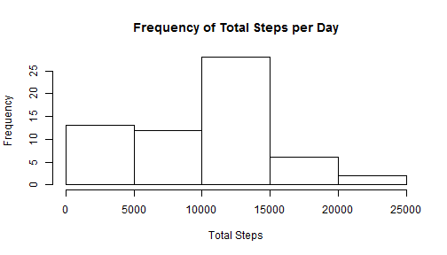
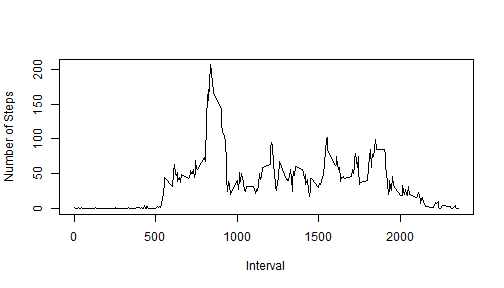
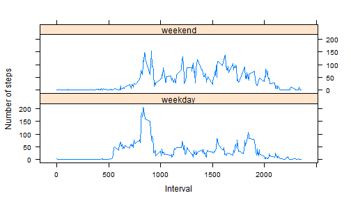

## Loading and preprocessing the data

### Load the data.

In this step we load the data from our working directory into a variable called 
        activity.  


```r
activity <- read.csv("activity.csv")
```

### Process/transform the data into a format suitable for your analysis

Next we convert the date field to a date data type.


```r
activity$date <- as.Date(activity$date)
```


## What is mean total number of steps taken per day?

For this part of the assignment, missing values will be ignored

### Calculate the total number of steps taken per day.

We have to be sure to specify removing NA values when summing.


```r
total_per_day <- sapply(split(activity$steps, activity$date), sum, na.rm=TRUE)
```

### Make a histogram of the total number of steps taken each day.


```r
hist(total_per_day, main="Frequency of Total Steps per Day", xlab="Total Steps")
```

 

### Calculate and report the mean and median of the total number of steps taken 
        per day

Again, we have to be sure to specify removing NA values. 


```r
mean_total_steps_per_day <- mean(total_per_day, na.rm=TRUE)
median_total_steps_per_day <- median(total_per_day, na.rm=TRUE)
```

The mean of the total steps per day was 9354.2295082.

The median of the total steps per day was 10395.

## What is the average daily activity pattern?

### Make a time series plot (i.e. type = "l") of the 5-minute interval (x-axis) 
        and the average number of steps taken, averaged across all days (y-axis)


```r
mean_per_interval <- sapply(split(activity$steps, activity$interval), mean
                            , na.rm=TRUE)
plot(names(mean_per_interval), mean_per_interval, type="l"
     , ylab="Number of Steps", xlab="Interval")
```

 

### Which 5-minute interval, on average across all the days in the dataset, 
        contains the maximum number of steps?


```r
max_interval_begin <- names(mean_per_interval[mean_per_interval==max(mean_per_interval)])

max_interval_end <- as.integer(max_interval_begin) + 5
```

On average over all days, interval [835 to 
840) had the maximum number of steps.

## Imputing missing values

### Calculate and report the total number of missing values in the dataset 
        (i.e. the total number of rows with NAs)


```r
missing_rows <- dim(activity[is.na(activity$steps),])[1]
```

The number of rows with missing values is 2304.

### Devise a strategy for filling in all of the missing values in the dataset.

We will fill in missing values with the median value over all days 
for values having the same interval as the missing value.

### Create a new dataset that is equal to the original dataset but 
        with the missing data filled in.
        
In the following we calculate the median value over all days for each interval
and then fill in any missing values with the corresponding median for the 
interval in a new data frame called activity_no_missing.


```r
##get median for each interval over all dates
median_by_interval <- sapply(split(activity$steps, activity$interval), 
                             median, na.rm=TRUE)

##copy all activities to new dataframe 
activity_no_missing <- activity

##get a vector of the rows with missing values
missing <- is.na(activity)

##loop over the intervals and filling in the missing values
## for with the median for the matching interval
for(id in 1:length(median_by_interval))
{
        activity_no_missing[missing,]$steps[
                activity_no_missing[missing,]$interval 
                        %in% as.integer(names(median_by_interval[id]))] <- 
                                median_by_interval[id]
}
```

### Make a histogram of the total number of steps taken each day and Calculate 
        and report the mean and median total number of steps taken per day.


```r
total_no_missing <- 
        sapply(split(activity_no_missing$steps, activity_no_missing$date), sum)

mean_no_missing <- mean(total_no_missing)
median_no_missing <- median(total_no_missing)


hist(total_no_missing, main="Frequency of Total Steps per Day", 
        xlab="Total Steps")
```

 

After replacing missing values, the mean of the total steps per day was 
9503.8688525 and the median was 10395.  
Replacing the missing values increased the average total per day by 
a small amount but had no impact on the median and only slight 
impact in the frequency.

## Are there differences in activity patterns between weekdays and weekends?


### Create a new factor variable in the dataset with two levels - "weekday" 
        and "weekend" indicating whether a given date is a weekday or weekend day.

Factor varaible weekday_type added to data frame indicating if the day is 
a weekday or weekend.


```r
weekend <- weekdays(activity_no_missing$date) %in% c("Sunday", "Saturday") 
activity_no_missing$weekday_type[weekend] <- "weekend" 
activity_no_missing$weekday_type[!weekend] <- "weekday"
activity_no_missing$weekday_type <- as.factor(activity_no_missing$weekday_type)
```

### Make a panel plot containing a time series plot (i.e. type = "l") of 
        the 5-minute interval (x-axis) and the average number of steps taken, 
        averaged across all weekday days or weekend days (y-axis).
        
Take the average by weekday or weekend and interval 
then plot over interval grouping by weekend or weekday.


```r
avg_steps_weekdays <- 
        aggregate(steps ~ interval + weekday_type, data=activity_no_missing
                  , mean)

library(lattice)

xyplot(steps ~ interval | weekday_type, data = avg_steps_weekdays, type="l"
       ,ylab="Number of steps", xlab="Interval", layout = c(1:2))
```

 
